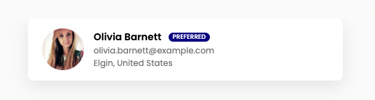
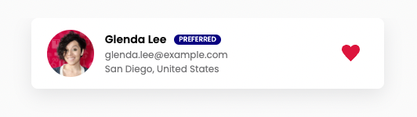

# Melio Candidates

Welcome to the Melio Candidates app.
This is a simple app which displays randomly generated candidates data in a list, using the `randomuser.me` API.

[Watch Melio Candidates App example video](https://user-images.githubusercontent.com/39100923/154835000-7da24dff-9802-4a8a-8c39-f252f3f612ac.mov)

### Motivation
The purpose of this task is to give you a glimpse into the bootcamp training process and into our day-to-day work as a developers.
You'll be provided with initial starter code, as well as several React Components. 
You're not expected to know React, html, css, and javascript in depth in order to complete this task.
To have the basic knowledge to complete the task, we will ask you to watch some crash courses on YouTube, like the following: 
- [HTML - 30min](https://www.youtube.com/watch?v=XiQ9rjaa2Ow)
- [CSS - 30min](https://www.youtube.com/watch?v=1PnVor36_40)
- [Javascript - 1h](https://www.youtube.com/watch?v=W6NZfCO5SIk&t=13s)
- [React - 1.5h](https://www.youtube.com/watch?v=w7ejDZ8SWv8)

Or, you can choose any other courses for beginners you like.

###### This is a Frontend task, there's no need for a backend, you'll be provided with an API endpoint which you'll use to fetch data from. 

## Getting Started

To get this app running locally you need to complete several steps:

1. Install [Node](https://nodejs.org/en/download/), [Git](https://git-scm.com/downloads) on your computer, and an IDEA - we use [intellij](https://www.jetbrains.com/idea/download/#section=mac) or [vscode](https://code.visualstudio.com/download), but you can choose another one :)  
2. Make sure you have a [Github](https://github.com) account
3. [Fork this repository](https://github.com/levyeliran/melio-bootcamp-home-assignment) to your GitHub account
4. Clone your newly created repository
5. Open a terminal and go inside the created repository folder (in your OS or inside intellij IDEA if you are using it)
6. Run `npm install` - this will install the external node packages we use in this project
7. Run `npm start` - this will run the app locally, on your computer
8. Your local app should now be available at `http://localhost:3000/home`

### Your Tasks

This project includes four tasks, all of which are mandatory.
Our primary goal is for you to learn new skills during this process, you can also consult with Google and friends, 
Make sure you fully understand your code, as you need to explain why you implemented what you implemented :)


### Task 1 - Working with data

In order to receive the candidates' data, you would need to fetch it from the `randomuser.me` API - an API which generates random user data on demand.
You'll be accessing the API using the URL constant which you were provided with.
For this task, we created 3 files, they are located inside src/utils folder:
- API.js file, you need to implement your fetching data logic there.
- helper.js files, you need to implement your manipulating/transforming data and general functionality logic there.
- playground.js file, to test your first task output, you can execute your code there.

<u>Fetching and transforming the candidates' data:</u>
1. The candidate data should then be grouped alphabetically by `first names`, and normalized to the following format:

```js
{
	A: [
		{
			firstName,
			lastName,
			email,
			city,
			country,
			picture,
			uuid,
			isFavorite,
			isPreferred,
		},
		...
	],
	B: [
		...
	]
}
```

2. We would like to mark certain candidates as `preferred` candidates.
   `Preferred` clients are ones which are from native English-speaking <u>countries</u>, such as USA and England.
   Add an `isPreferred` property to each candidate which decides whether or not a candidate is `preferred`, this would be used for the UI later on.

3. We would like to mark certain candidates as `favorited` candidates.
   Add an `isFavorite` property to each candidate as well, as setup for a future task.


### Task 2 - Candidate Card List

You're provided with a boilerplate implementation of this app, with the following React Components:

- App - the main component that initiating the app, it manages the app routes and it's components correspondingly
- Navbar + NavLink - the app navigation component
- Card - the candidates' representation
- FavoriteIcon - a wrapper component to a svg file
- Home - the main page of the app, it should contain the candidates' cards list

Your task is to implement the Card component as presented in this image:



It doesn't have to be pixel perfect. Do the best you can to implement the Card component's UI, make it look good 😎

###### Feel free to create any additional components as you see fit, but it definitely isn't mandatory.

### Task 3 - Mark favorites

We want you to add the ability to mark favorite candidates. To do so, we need to add some functionality to Card component.
Each candidate card should display a heart icon while hovered, as presented in this image:



Once you click on the heart icon, you should set the candidates property `isFavorite` (from Task 1) to be true.

In addition, we want you to save the user selection. you will need to implement the following:

1. Add functionality which enables selecting a candidate as a favorite
   - Should be persistent - refreshing or closing the site will not reset the favorites
2. Once a candidate is Favorited, the heart icon should stay visible even if the candidate is not currently being hovered over
3. Add relevant style to the Home page as diaplayed in the video (Note that we have mobile view as well)

### Task 4 - Favorite page

We want to create a dedicated page for favorite candidates - they deserve it!
To do so, we need to create a new route to the app called `/favorites` which display a new page called `Favorites`

1. Create a new `Favorite` Page
2. Add new navigation capability which would allow us to navigate to the Favorites Page, place it right to the Home link in the Navbar
3. Add relevant style to the navigation bar as diaplayed in the video
4. The Favorites Page should display only of the Favorited candidates
<br />
<u>Hint:</u> check the configuration and behavior of Home page, they should act quite similar.

## Aaand...that's it! You're all done 🎉

## Requirements

- All the code that you'll change / add will be inside the `/src` folder.
- Avoid leaving behind unused code, as well as make sure that your code is clean, formatted, and without any `console.logs`.
- Make sure all the code is committed and pushed.
- Make sure your console is free of `errors`, don't waste time on `warnings` if you don't know how to solve them, it's totally ok.
- Email us your git repository link and a video of your app (totally optional!) to the following address: bootcamp@melio.com

#### Remember: this task is designed to see how you complete tasks that require self learning, not to test your existing knowledge, it's ok if things are not perfect!

For any question, feel free! to reach out to us, anytime: 
- Eliran at: eliran.levy@melio.com
- Shiran at: shiran.marco@melio.com

## Good Luck!
